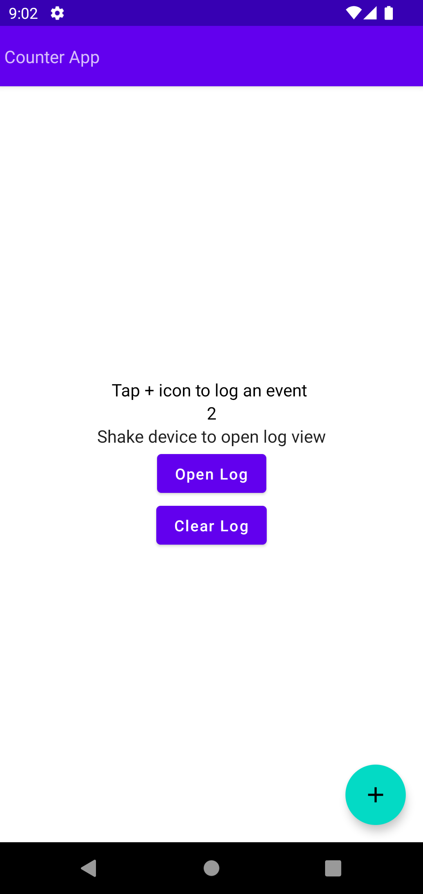
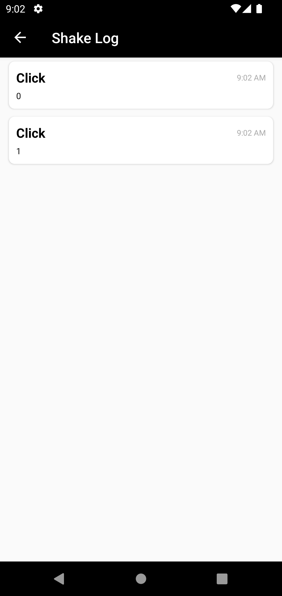

# ShakeLog
		

#Introduction
A shake log library for logging key-value based events and errors in Android applications. This library allows you to view the logs by simply shaking the device.
This library aims to be easier to integrate into your apps and workflows:

- all configuration occurs in your custom [`Application`](http://developer.android.com/reference/android/app/Application.html) subclass (no view hierarchy alterations required);
- no need to request extra permissions;


# Getting Started

1. Specify ShakeLog as a dependency in your build.gradle file:

	```gradle
	dependencies {
	    implementation("com.github.sunnysyed:ShakeLog:{latest-version}")
	}
	```

2. Configure the shared `ShakeLog` instance in your custom [`Application`](http://developer.android.com/reference/android/app/Application.html) class, then ShakeLog will aumtomatically begin listening for shakes:

	```kotlin
	class CustomApplication : Application {
        override fun onCreate() {
            super.onCreate()
            ShakeLog.init(this)
        }
    }
	```
3. To log an event after you have initialized `ShakeLog` call `logEvent`
	```kotlin
	ShakeLog.logEvent("Key", "Value")
	```

4. To view the logs, simply shake the device. The log activity will appear and display the key-value events.

It is recommended that logging always be disabled in production builds.

# Advanced Usage

- Open log programmatically using `ShakeLog.openLog()`
-  Clear log using `ShakeLog.clearLog()`

# License

    Copyright 2023 Sunny

    Licensed under the Apache License, Version 2.0 (the "License");
    you may not use this file except in compliance with the License.
    You may obtain a copy of the License at

       http://www.apache.org/licenses/LICENSE-2.0

    Unless required by applicable law or agreed to in writing, software
    distributed under the License is distributed on an "AS IS" BASIS,
    WITHOUT WARRANTIES OR CONDITIONS OF ANY KIND, either express or implied.
    See the License for the specific language governing permissions and
    limitations under the License.
